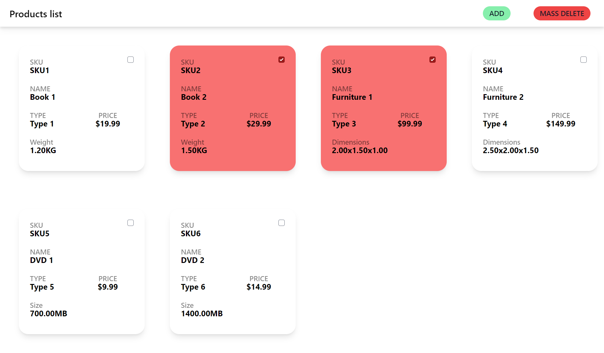

# Product Catalog

## Description
This project is a very simple product catalog, where you can add products to the catalog and view them. 

## Screenshots

## Used:
- Tailwindcss for styling
- JQuery for DOM manipulation
- PHP for backend

## Installation

### Prerequisites
- Node.js and NPM installed
- PHP installed

### Steps
1. Install a local server environment like XAMPP, WAMP, or MAMP.
2. Start the Apache and MySQL services in your chosen software.
3. Clone the project into the `htdocs` (for XAMPP and MAMP) or `www` (for WAMP) directory.
4. Open a web browser and navigate to `localhost/index.php`.

## Usage
Provide instructions on how to use your application.

## Author
- Amr Yousef